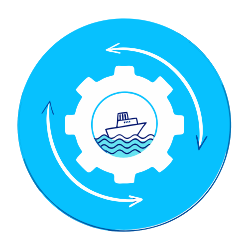

# ShippingConverter v2.0

<p align="center">
  
</p>

A modern shipping data converter tool with **Nuxt 3** frontend and **FastAPI** backend.

[](https://github.com/wulukewu/shipping-converter/actions/workflows/docker-build.yml)
[](https://github.com/wulukewu/shipping-converter/actions/workflows/backend-ci.yml)
[](https://github.com/wulukewu/shipping-converter/actions/workflows/frontend-ci.yml)

## 🏗️ Architecture

This project has been refactored with a modern architecture:

- **Frontend**: Nuxt 3 (Vue 3) - Modern, reactive UI with file-based routing
- **Backend**: FastAPI - High-performance Python API with automatic OpenAPI documentation
- **Processing**: Python scripts for various shipping data formats

## 📁 Project Structure

```
shipping-converter/
├── backend/
│   ├── app/
│   │   ├── api/          # API routes
│   │   ├── core/         # Configuration
│   │   ├── models/       # Pydantic schemas
│   │   ├── services/     # Business logic
│   │   ├── utils/        # Utilities
│   │   └── main.py       # FastAPI application
│   ├── requirements.txt
│   └── Dockerfile
├── frontend/
│   ├── assets/           # CSS and static assets
│   ├── components/       # Vue components
│   ├── layouts/          # Layout components
│   ├── pages/            # Page components (auto-routing)
│   ├── public/           # Public static files
│   ├── nuxt.config.ts    # Nuxt configuration
│   ├── package.json
│   └── Dockerfile
├── scripts/              # Processing scripts (shared)
├── uploads/              # Upload directory
└── docker-compose.yml
```

## 🚀 Getting Started

### Prerequisites

- Python 3.11+
- Node.js 20+
- Docker & Docker Compose (for containerized deployment)

### Local Development

#### Backend

```bash
cd backend
pip install -r requirements.txt
uvicorn app.main:app --reload --port 8000
```

The API will be available at `http://localhost:8000`
API documentation: `http://localhost:8000/docs`

#### Frontend

```bash
cd frontend
npm install
npm run dev
```

The frontend will be available at `http://localhost:3000`

### Docker Deployment

```bash
docker-compose -f docker-compose.yml up -d
```

Services:
- Frontend: `http://localhost:3000`
- Backend: `http://localhost:8000`
- API Docs: `http://localhost:8000/docs`

## 🔧 Configuration

### Environment Variables

Create a `.env` file in the root directory:

```env
# Discord Webhook (recommended)
DISCORD_WEBHOOK_URL=your_discord_webhook_url

# Discord Bot (fallback - only needed if webhook not used)
# DISCORD_TOKEN=your_discord_token
# DISCORD_GUILD_ID=your_discord_guild_id
# DISCORD_CHANNEL_ID=your_discord_channel_id

# API Configuration (optional)
NUXT_PUBLIC_API_BASE=http://localhost:8000
```

### Processors

The application supports the following processors:

- **詠業** (Unictron)
- **詠業2** (Unictron_2)
- **DTJ 宏美** (DTJ_H)
- **詠聯** (YONG_LAING)
- **詠聯-敘述** (YONG_LAING_desc)
- **威鋒** (VLI)
- **日月光** (ASECL)

## 📡 API Endpoints

### Core Endpoints

- `GET /` - API information
- `GET /health` - Health check
- `GET /api/processors` - List available processors

### Processing Endpoints

- `POST /api/process/{processor_type}` - Upload and process file
- `GET /api/download/{filename}` - Download processed file

### Example Usage

```bash
# Upload and process file
curl -X POST "http://localhost:8000/api/process/unictron" \
  -F "file=@/path/to/file.xlsx"

# Download processed file
curl -O "http://localhost:8000/api/download/{filename}"
```

## 🎨 Features

- ✅ Modern, responsive UI with Nuxt 3
- ✅ Drag-and-drop file upload
- ✅ Real-time processing feedback
- ✅ RESTful API with FastAPI
- ✅ Automatic API documentation (OpenAPI/Swagger)
- ✅ Discord notifications for errors
- ✅ Docker support for easy deployment
- ✅ Type safety with Pydantic
- ✅ CORS enabled for cross-origin requests

## 📝 API Documentation

When the backend is running, visit `http://localhost:8000/docs` for interactive API documentation powered by Swagger UI.

## 🔄 Migration from v1

The original Flask application has been refactored:

- **Flask** → **FastAPI**: Better performance, automatic API docs, type safety
- **Jinja2 Templates** → **Nuxt 3**: Modern SPA with Vue 3, better UX
- **Monolithic** → **Microservices**: Separate frontend and backend
- **No router** → **File-based routing**: Automatic routing in Nuxt

All existing processing scripts remain compatible and are used by the new backend.

## 🤝 Contributing

Contributions are welcome! Please open an issue or submit a pull request for any improvements or bug fixes.

## 📄 License

This project is licensed under the MIT License. See the LICENSE file for details.

## 📞 Support

For issues and questions, please open an issue on GitHub.
