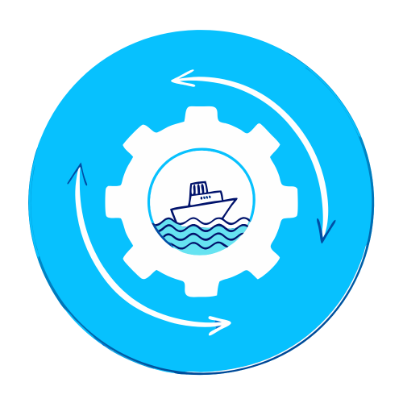

# ShippingConverter

<p align="center">
  
</p>

ShippingConverter is a tool for converting shipping data. This project includes a Flask web application and Docker support.

## Getting Started

### Prerequisites

- Python 3.9 or higher
- Docker

### Installation

1. Clone the repository:
    ```sh
    git clone https://github.com/yourusername/shipping-converter.git
    cd shipping-converter
    ```

2. Install the required Python packages:
    ```sh
    pip install -r requirements.txt
    ```

### Running the Application

To run the Flask application locally, use the following command:
```sh
flask run
```

### Build and Run Docker

To build and run the Docker container, use the following commands:

1. Build the Docker image:
    ```sh
    docker build -t shipping-converter .
    ```

2. Run the Docker container:
    ```sh
    docker run -d -p 5000:5000 --name shipping-converter shipping-converter
    ```

### Pull Docker Image

To pull the Docker image from GitHub Hub, use the following command:
```sh
docker pull wulukewu/shipping-converter:latest
```

### GitHub Actions

This project uses GitHub Actions to automate the release process and Docker image publishing.

#### Workflows

1. **Release Please**: Automates the release process based on conventional commits.
2. **Build Docker Image**: Builds and pushes the Docker image to GitHub Container Registry (ghcr.io).

### References

- [Automating Tag Creation, Release, and Docker Image Publish with GitHub Actions](https://dev.to/natilou/automating-tag-creation-release-and-docker-image-publishing-with-github-actions-49jg)

## Contributing

Contributions are welcome! Please open an issue or submit a pull request for any improvements or bug fixes.

## License

This project is licensed under the MIT License. See the LICENSE file for details.

### Explanation:
1. **Getting Started**: Added sections for prerequisites, installation, and running the application.
2. **Build and Run Docker**: Provided clear steps to build and run the Docker container.
3. **GitHub Actions**: Added a section to explain the GitHub Actions workflows used in the project.
4. **Contributing**: Added a section to encourage contributions.
5. **License**: Added a section for the license information.